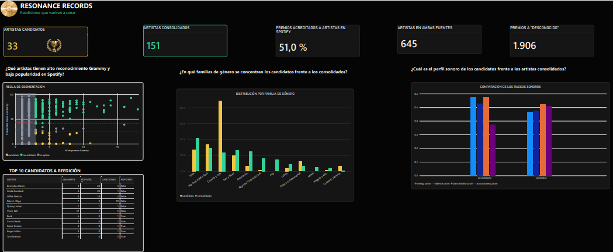

# Resonance Records — Reliable Batch Data Pipeline (ETL Workshop 2)

**Course:** ETL (G01) · Data Engineering and Artificial Intelligence
**Stack:** Apache Airflow 3.1.8 (TaskFlow API) · Great Expectations 1.23.1 · PostgreSQL 16 · Docker Compose · Power BI

A reliable batch pipeline that integrates **Spotify tracks (CSV)** with **Grammy Awards (relational
source database)**, validates both sources and the prepared result with Great Expectations, and loads a
**trusted dimensional Data Warehouse** that feeds a Power BI dashboard.

> Reliable does not mean that nothing fails. In this project failures are anticipated (quality rules),
> controlled (gates, rollback, selective retries) and observable (Airflow states, logs and evidence files).

---

## Table of Contents

1. [Problem and Analytical Objective](#1-problem-and-analytical-objective)
2. [Analytical Requirements and Scope](#2-analytical-requirements-and-scope)
3. [Data Sources](#3-data-sources)
4. [Pipeline Architecture](#4-pipeline-architecture)
5. [Environment and Source Preparation](#5-environment-and-source-preparation)
6. [Data Profiling Findings and Quality Risks](#6-data-profiling-findings-and-quality-risks)
7. [Dimensional Model](#7-dimensional-model)
8. [Data Quality Rules](#8-data-quality-rules)
9. [Great Expectations Validation Design](#9-great-expectations-validation-design)
10. [Extraction and Raw Validation](#10-extraction-and-raw-validation)
11. [Transformation and Integration Strategy](#11-transformation-and-integration-strategy)
12. [Prepared Data Validation](#12-prepared-data-validation)
13. [Data Warehouse Loading](#13-data-warehouse-loading)
14. [Airflow DAG Design, Failure and Retry Policy](#14-airflow-dag-design-failure-and-retry-policy)
15. [Mandatory Reliability Tests](#15-mandatory-reliability-tests)
16. [Reliability Evidence Register](#16-reliability-evidence-register)
17. [Dashboard and Analytical Outputs](#17-dashboard-and-analytical-outputs)
18. [End-to-End Traceability Matrix](#18-end-to-end-traceability-matrix)
19. [Setup and Execution Instructions](#19-setup-and-execution-instructions)
20. [Repository Structure](#20-repository-structure)
21. [Assumptions and Limitations](#21-assumptions-and-limitations)

---

## 1. Problem and Analytical Objective

**Resonance Records** is a (fictional) record label that reissues catalog music. Its A&R team wants to
find artists whose work was **recognized by the music industry** (Grammy Awards) but who have **low
presence on today's streaming platforms** (Spotify). Those artists are the best candidates for a
reissue (remasters, anniversary editions, acoustic sessions).

Neither source can answer this alone:

- **Grammy** tells *who was recognized*, but nothing about current listening.
- **Spotify** tells *what is popular today*, but nothing about industry recognition.

The objective is a trusted data product that **combines both sources at artist level** and answers
three analytical requirements (AR1–AR3).

**Scope statement.** The pipeline processes the full Spotify CSV snapshot and the full Grammy source
table as one batch, integrates them through a normalized artist key, segments Grammy-recognized artists
into *candidates* and *consolidated* artists, and loads a star schema in PostgreSQL. Out of scope:
nominations (the Grammy source only contains winners), real-time streaming metrics, and popularity
trends over time (the Spotify snapshot has no extraction date).

---

## 2. Analytical Requirements and Scope

| ID | Analytical Requirement | Required Data | Source(s) | Expected KPI(s) | Required Level of Detail |
|---|---|---|---|---|---|
| **AR1** | Which artists have **high Grammy recognition** and **low Spotify popularity** (reissue candidates)? | Grammy: `artist`, `category`, `year` · Spotify: `artists`, `track_id`, `popularity` | Grammy DB + Spotify CSV | Number of candidates (≥ 3 Grammys and max popularity < 25); candidates with popularity 0; number of consolidated artists; ranked candidate list | Artist |
| **AR2** | In which **genre families** do the candidates concentrate, compared with consolidated artists? | Spotify: `track_genre`, `artists`, `track_id` · Grammy: `artist` (to define the segment) | Spotify CSV + Grammy DB | Share (%) of each segment's track–genre assignments per genre family | Segment × genre family |
| **AR3** | What is the **sonic profile** of candidates compared with consolidated artists? | Spotify: `energy`, `valence`, `danceability`, `acousticness`, `explicit`, `track_id`, `artists` · Grammy: `artist` (segment) | Spotify CSV + Grammy DB | Average energy, valence, danceability and acousticness per segment | Segment × audio feature (averaged over distinct tracks) |

**Why both sources are necessary.** The *segment* of an artist (candidate / consolidated) needs the
number of Grammy awards **and** the Spotify popularity of the same artist. AR2 and AR3 then describe
those segments with Spotify attributes (genre, audio features). Without the Grammy side there are no
segments; without the Spotify side there is no popularity, genre or sound.

**Segmentation rule (used by every requirement).**

| Segment | Rule | Result |
|---|---|---|
| `candidato` | ≥ 3 Grammy awards **and** max track popularity < 25 | 33 artists (15 with popularity 0) |
| `consolidado` | ≥ 3 Grammy awards **and** max track popularity ≥ 41 | 151 artists |
| `no aplica` | Everything else (1–2 awards, the 25–40 band, single-source artists, unknown member) | — |

Thresholds are evidence-based (see §11.5): 3 awards = p75 of awards per Grammy artist; 25 and 41 = p25
and p50 of max popularity over the whole Spotify catalog.

Requirement IDs (AR1–AR3) are used consistently in the profiling risks, quality rules, transformation
rules, model, dashboard and traceability matrix.

---

## 3. Data Sources

| Source | Provided form | Pipeline extraction source | Grain | Size |
|---|---|---|---|---|
| Spotify tracks | CSV file | CSV file `data/raw/spotify_dataset.csv` (read by `extract_spotify`) | One row per track × genre | 114,000 rows |
| Grammy Awards | CSV file | PostgreSQL table `grammy_source.public.grammy_awards` (read by `extract_grammys`) | One row per award won | 4,810 rows (1958–2019) |

> **Required evidence:** the operational pipeline extracts Grammy data **from the relational source
> database**, not from the CSV. `src/extract.py::extract_grammys` runs
> `SELECT * FROM grammy_awards ORDER BY source_row_number` against `grammy_source`, and its metadata file
> records `"source": {"type": "postgresql", "database": "grammy_source", "table": "grammy_awards"}`.
> Loading the CSV into that table is **source preparation** (§5.2), not the ETL load.

---

## 4. Pipeline Architecture

### 4.1 Conceptual architecture (reliable pipeline pattern)

```
 SOURCE            EXTRACT            RAW VALIDATION        TRANSFORM               PREPARED VALIDATION     LOAD          TARGET
 Spotify CSV ───►  extract_spotify ─► validate_spotify_raw ─┐
                                                             ├─► transform_and_integrate ─► validate_prepared ─► load_dw ─► music_dw ─► Power BI
 Grammy DB   ───►  extract_grammys ─► validate_grammys_raw ─┘
```

| Layer | Question it answers | Implementation |
|---|---|---|
| Extraction | Acquire the batch without hiding problems | `src/extract.py` (no cleaning; raw copy + metadata per run) |
| Raw validation | Can these data safely enter transformation? | `src/validation.py` (GX suites `spotify_raw_suite`, `grammy_raw_suite`) |
| Transformation | Clean, standardize, integrate, derive | `src/transform.py` (rules S, G, GR, I, SG, K) |
| Prepared validation | Is the prepared batch load-ready? | `src/validation.py` (4 prepared suites, DQ14–DQ22) |
| Load | Write the dimensional structures safely | `src/load.py` (transactional truncate-and-load) |
| Target | Trusted analytical store | PostgreSQL `music_dw` (star schema) |
| Analytics | KPIs and dashboard | `sql/analytics_views.sql`, Power BI `dashboard/resonance_reissue_radar.pbix` |

Quality design around the flow: **Profiling → Quality risks → Quality rules → GX Expectations →
Validation gates**. Reliability controls: **dependencies, selective retries, logs, controlled failure,
transactional load, safe rerun**.

### 4.2 Implemented DAG

`dags/reliable_music_pipeline.py` — DAG id `reliable_music_pipeline` (Airflow 3.1.8, `from airflow.sdk import dag, task`).

```
extract_spotify -> validate_spotify_raw --\
                                           >-- transform_and_integrate -> validate_prepared -> load_dw
extract_grammys -> validate_grammys_raw --/
```

The DAG only orchestrates; the logic lives in `src/` (`extract`, `validation`, `transform`, `load`).
Screenshot of the graph: `docs/evidence/screenshots/test_a_grid.png`.

---

## 5. Environment and Source Preparation

### 5.1 Environment

| Component | Choice |
|---|---|
| Orchestrator | Apache Airflow **3.1.8** in Docker Compose (official compose file, `LocalExecutor`, examples disabled) |
| Airflow image | Custom image `resonance-airflow:3.1.8` (`Dockerfile` + `requirements.txt`: pandas, Great Expectations 1.23.1) |
| Airflow metadata DB | `postgres` service (not used by the pipeline) |
| Data database | `data-db` service (PostgreSQL 16, host port **5433**) with two databases: `grammy_source` (operational source) and `music_dw` (Data Warehouse) |
| Validation | Great Expectations 1.23.1 (ephemeral context, suites built in code) |
| BI tool | Power BI Desktop (Import mode over `music_dw`) |
| Profiling | Local Python 3.12 virtual environment (`requirements-dev.txt`: pandas, ydata-profiling, jupyter) |
| Version control | Git + GitHub |

Mounted into the Airflow containers: `dags/`, `src/`, `data/`, `gx/`, `sql/`, `scripts/`, `docs/`
(`PYTHONPATH=/opt/airflow`). Database credentials come from `.env` (never committed);
`.env.example` documents the required variables with placeholder values.

Environment check: `scripts/check_environment.py` → `docs/evidence/environment_check.txt`
(library versions and database connectivity).

| Checklist (brief §6.2) | Status / Evidence |
|---|---|
| Docker Compose environment starts reproducibly | ✅ `docker compose up -d` (see §19) |
| Airflow reports version 3.1.8 | ✅ `environment_check.txt` |
| Spotify CSV available through the documented path | ✅ `data/raw/spotify_dataset.csv` |
| Grammy source table exists and reconciles with the CSV | ✅ `docs/evidence/source_reconciliation.json` |
| Secrets not committed; `.env.example` documents variables | ✅ `.env` in `.gitignore` |
| Connection setup and execution commands documented | ✅ §19 |

### 5.2 Grammy source preparation

| Step | Detail |
|---|---|
| Table definition | `sql/source_setup.sql` creates `grammy_awards` in `grammy_source` with the original CSV columns (`year`, `title`, `published_at`, `updated_at`, `category`, `nominee`, `artist`, `workers`, `img`, `winner`) plus `source_row_number` (**primary key**, the original row order) for traceability. |
| Import | `scripts/load_grammy_source.py` reads the CSV **without modifying it** and loads it with `DELETE + INSERT` in **one transaction** (re-runnable, never duplicates). |
| Reconciliation | Rows CSV = rows table = **4,810**; null counts preserved (`nominee` 6, `artist` 1,840, `workers` 2,190, `img` 1,367); years 1958–2019. Evidence: `docs/evidence/source_reconciliation.json`. |
| Decisions | Values are imported as delivered (no cleaning at this stage); empty fields become `NULL`; the original CSV files stay untouched in `data/raw/` (marked binary in `.gitattributes`). |

This import creates the **operational source**. It is not the ETL load into the Data Warehouse.

---

## 6. Data Profiling Findings and Quality Risks

**Notebook:** `notebooks/data_profiling.ipynb` (reproducible; reads the raw files without altering them).
**Outputs:** `reports/*.html` (ydata-profiling) and `docs/evidence/profiling/*.csv | *.png` (tables and
figures that support every risk), plus `docs/evidence/profiling/profiling_risk_table.md`.

Profiled scope (attributes required by AR1–AR3):
Grammy `year`, `category`, `artist` · Spotify `track_id`, `artists`, `popularity`, `explicit`,
`track_genre`, `energy`, `valence`, `danceability`, `acousticness`.

### 6.1 Main findings

| Evidence category | Finding |
|---|---|
| Structure | Spotify: 114,000 rows, 21 columns (includes a technical index column). Grammy: 4,810 rows, 10 columns (+ `source_row_number`). All required attributes present. |
| Completeness | Grammy `artist`: **1,840 nulls (38.25 %)**, concentrated in technical categories (engineering, production, album notes) that never credit a performer. Spotify `artists`: 1 null. |
| Uniqueness | Spotify `track_id` is **not unique**: 114,000 rows → **89,741** distinct tracks (one row per track × genre); 720 tracks have different popularity across copies. Grammy: 2 repeated (`year`, `category`, `artist`) combinations. |
| Categorical content | 114 Spotify genre labels (too granular for AR2). 637 Grammy categories with spelling variants over time. Grammy `winner` is always `True` (every row is a won award). |
| Numerical content | `popularity` within 0–100, **≈14 % of rows at popularity 0**; audio features within 0–1; `explicit` ∈ {True, False}. |
| Temporal content | Grammy years 1958–2019 without gaps (62 ceremonies). Spotify has **no extraction date**: popularity is a snapshot. |
| Cross-source consistency | Only **32.2 %** of distinct Grammy artist names match Spotify after basic normalization; collaborations ("A featuring B"), leading articles ("The …") and accents break exact matching. Spotify `artists` contains several artists separated by `;`. |

### 6.2 Evidence → Risk → Requirement table

| ID | Dataset / Attribute | Profiling Evidence | Potential Quality Risk | Related Requirement |
|---|---|---|---|---|
| PR01 | Grammy / `artist` | 1,840 nulls (38.25 %); technical categories never have an artist | Awards not attributable to an artist; recognition undercounted | AR1, AR2, AR3 |
| PR02 | Grammy / `artist` | Part of the non-null values are collaborations (featuring, &, commas) | Composite text does not match an individual Spotify artist | AR1 |
| PR03 | Grammy ↔ Spotify / artist | 32.2 % of distinct Grammy names match after normalization | Without normalization and collaboration handling, valid candidates are lost | AR1, AR2, AR3 |
| PR04 | Spotify / `track_id` | 24,259 duplicate rows (one per genre); 720 tracks with different popularity | Double counting of tracks; inflated popularity and audio averages | AR1, AR3 |
| PR05 | Spotify / `track_genre` | 114 distinct labels | Too granular to support a decision; needs genre families | AR2 |
| PR06 | Spotify / `artists` | 1 null; many rows with several artists (`;`) | Rows without artist cannot be matched; collaborations must be split | AR1, AR2, AR3 |
| PR07 | Spotify / `popularity` | ≈14 % of rows at popularity 0; none outside [0, 100] | 0 may be real or a missing value; biases the "low popularity" threshold | AR1, AR3 |
| PR08 | Spotify / audio features, `explicit` | No values outside [0, 1]; `explicit` ∈ {True, False} | An out-of-scale value would distort the sonic profile | AR3 |
| PR09 | Spotify / popularity (temporal) | No extraction date | Popularity is a point-in-time snapshot; no trend analysis | AR1 (limitation) |
| PR10 | Grammy / `year` | Coverage 1958–2019, no missing years | A year out of range would distort the recognition period | AR1 |
| PR11 | Grammy / `winner` | Always `True` | Each record is a won award: counting rows = counting awards (no nominees) | AR1 (KPI definition) |
| PR12 | Grammy / (`year`, `category`, `artist`) | 2 repeated combinations | The same recognition could be counted twice | AR1 |

Exact counts per risk are regenerated by the notebook in `docs/evidence/profiling/profiling_risk_table.csv`.

---

## 7. Dimensional Model

The model was designed **before** the final transformation logic, driven by AR1–AR3. It is a
**star schema in constellation form**: two fact tables share the **conformed dimension `dim_artist`**.


(Editable source: `docs/modelo_dimensional.dbml`, renderable at dbdiagram.io. Executable DDL: `sql/dw_schema.sql`.)

### 7.1 Design decisions

| Design decision | Content |
|---|---|
| **Business processes** | (1) **Grammy award recognition** → `fact_award`. (2) **Spotify catalog snapshot** (track popularity and sound) → `fact_track`. |
| **Grain** | `fact_award`: **one row per Grammy award × credited artist** (an award shared by "A featuring B" gives 2 rows). `fact_track`: **one row per unique Spotify track** (`track_id`). |
| **Dimensions** | `dim_artist` (conformed, both sources), `dim_category` (award category and type), `dim_year` (ceremony year and decade), `dim_genre` (Spotify genre and genre family). |
| **Bridges (N:M)** | `bridge_track_artist` (a track can have several artists), `bridge_track_genre` (a track can have several genres). |
| **Measures** | `fact_award.award_count` (= 1, additive). `fact_track.popularity` (0–100), `energy`, `valence`, `danceability`, `acousticness` (0–1, non-additive → averaged), `is_explicit` (0/1, its mean = share of explicit tracks). Derived artist attributes in `dim_artist`: `total_awards`, `track_count`, `avg_popularity`, `max_popularity`, `segment`, `popularity_zero`. |
| **Keys** | Integer **surrogate keys** assigned deterministically (sort by business key, number from 1 — rule K1/I4). Business keys kept and `UNIQUE`: `artist_norm`, `track_id`, `category_name`, `year`, `genre`. Degenerate dimensions: `fact_award.source_row_number` (traceability to the source row) and `fact_track.track_id`. |
| **Unknown member** | `dim_artist.artist_key = 0` ("Desconocido") receives the 1,906 awards without an identifiable artist, so every award is kept and totals reconcile with the source. |
| **Relationships** | `fact_award` → `dim_artist`, `dim_category`, `dim_year`; `bridge_track_artist` → `fact_track`, `dim_artist`; `bridge_track_genre` → `fact_track`, `dim_genre`. All enforced with `FOREIGN KEY` constraints. |

### 7.2 How the model supports each requirement

| Requirement | Facts / dimensions used | Query path |
|---|---|---|
| AR1 | `dim_artist` (`total_awards`, `max_popularity`, `segment`, `popularity_zero`), `fact_award` | Count and rank artists by segment; awards per artist from `fact_award` |
| AR2 | `dim_artist.segment` → `bridge_track_artist` → `fact_track` → `bridge_track_genre` → `dim_genre.genre_family` | Share of each segment's track–genre assignments per family |
| AR3 | `dim_artist.segment` → `bridge_track_artist` → `fact_track` (audio features) | Average audio features over the distinct tracks of each segment |

---

## 8. Data Quality Rules

Every rule is justified by **profiling evidence (PRxx)**, an **analytical requirement**, a **source
contract** or a **post-transformation invariant**. Thresholds protect the requirement; they were not
chosen just because the current batch passes.

### 8.1 Severity policy

| Severity | Meaning | Pipeline response | Retry? |
|---|---|---|---|
| **Critical** | The violation makes continued processing or loading unsafe | The validation task fails (`AirflowFailException`) and every downstream task ends `upstream_failed` | No — deterministic |
| **Warning** | Needs visibility but does not invalidate the batch | Recorded in the GX result and log; the pipeline continues | No |
| **Info** | Monitoring context or trend signal | Recorded for interpretation; never blocks | No |

Decision per gate: any failed Critical rule → `BLOCKED`; only Warning/Info failures → `PASS_WITH_FINDINGS`; none → `PASS`.

### 8.2 Rule table

| Rule ID | Dataset / Layer | Attribute(s) | Quality Dimension | Quality Rule | Metric / Threshold | Severity | Related Requirement |
|---|---|---|---|---|---|---|---|
| DQ01 | Spotify / raw | schema | Consistency | The 9 in-scope columns exist and the file is not empty | 9/9 columns; rows ≥ 1 | Critical | AR1–AR3 |
| DQ02 | Spotify / raw | `track_id` | Completeness | Every track has an identifier | 100 % not null | Critical | AR1, AR3 |
| DQ03 | Spotify / raw | `popularity` | Validity | Popularity present and within 0–100 | 100 % not null and in range | Critical | AR1–AR3 |
| DQ04 | Spotify / raw | `energy`, `valence`, `danceability`, `acousticness` | Validity | Audio features within 0–1 | 100 % in range | Critical | AR3 |
| DQ05 | Spotify / raw | `explicit` | Validity | Only `True` / `False` | 100 % in domain | Critical | AR3 |
| DQ06 | Spotify / raw | `track_genre` | Completeness | Every track has a genre | 100 % not null | Critical | AR2 |
| DQ07 | Spotify / raw | `artists` | Completeness | The track has at least one artist | ≥ 99 % not null | Warning | AR1–AR3 |
| DQ08 | Spotify / raw | `popularity` | Validity (plausibility) | Share of tracks with popularity > 0 | ≥ 80 % (`mostly=0.80`) | Info | AR1 |
| DQ09 | Grammy / raw | schema | Consistency | `year`, `category`, `artist` exist and the table is not empty | 3/3 columns; rows ≥ 1 | Critical | AR1–AR3 |
| DQ10 | Grammy / raw | `year` | Validity | Year present, between 1958 (first ceremony) and the current year | 100 % in range | Critical | AR1 |
| DQ11 | Grammy / raw | `category` | Completeness | Every award has a category | 100 % not null | Critical | AR1 |
| DQ12 | Grammy / raw | `artist` | Completeness | Share of awards with an artist | ≥ 60 % not null | Warning | AR1–AR3 |
| DQ13 | Grammy / raw | `year`, `category`, `artist` | Uniqueness | Unique combination when the artist exists | 0 repeated | Info | AR1 |
| DQ14 | Prepared / `fact_track` | `track_id` | Uniqueness | One row per track | 0 duplicates, 0 nulls | Critical | AR1, AR3 |
| DQ15 | Prepared / `dim_artist` | `artist_norm` | Validity / Uniqueness | Integration key not null, unique and normalized (lower case, no edge or repeated spaces) | 100 % compliant | Critical | AR1–AR3 |
| DQ16 | Prepared / `dim_genre` | `genre_family` | Validity | Every genre belongs to the family catalog | 100 % in catalog | Critical | AR2 |
| DQ17 | Prepared / `dim_artist` | `segment` | Validity | Segment ∈ {candidato, consolidado, no aplica} | 100 % in domain | Critical | AR1–AR3 |
| DQ18 | Prepared / `dim_artist` | `in_spotify` (Grammy artists) | Integration integrity | Share of identifiable Grammy artists found in Spotify | mean ≥ 0.25 | Warning | AR1–AR3 |
| DQ19 | Prepared / all 4 suites | schema | Consistency | Each prepared table has exactly the expected columns | exact column set | Critical | AR1–AR3 |
| DQ20 | Prepared / `fact_track` | `popularity`, audio features, `is_explicit` | Validity | Measures still valid after transformation | not null; 0–100 / 0–1 / {0, 1} | Critical | AR1, AR3 |
| DQ21 | Prepared / `fact_award` | `artist_key`, `category_key`, `year_key`, `award_count` | Completeness / Validity | Every award fact has its keys and `award_count = 1` | 100 % compliant | Critical | AR1 |
| DQ22 | Prepared / `dim_artist` | `segment` | Analytical readiness | Both `candidato` and `consolidado` exist in the batch | both values present | Warning | AR1, AR3 |

### 8.3 Justification of thresholds and severities

| Rule | Justification |
|---|---|
| DQ01–DQ06, DQ09–DQ11 | **Source contract**: without these fields or with values out of the documented scale (popularity 0–100, audio 0–1, ceremonies since 1958) no requirement can be answered safely. Out-of-scale values cannot be "repaired" without inventing data → Critical. |
| DQ07 (≥ 99 %) | PR06: 1 null observed. A few tracks without artist cannot be matched but do not invalidate the batch; more than 1 % would indicate an extraction problem. |
| DQ08 (≥ 80 %, Info) | PR07: ≈14 % at popularity 0. Zero may be real or missing. Above 20 % the "low popularity" threshold of AR1 would be dominated by possible missing values; monitored, not blocking (the flag `popularity_zero` keeps it visible downstream). |
| DQ12 (≥ 60 %) | PR01: 38.25 % nulls explained by technical categories that never credit performers (structural absence). Completeness below 60 % would no longer be explained by the source structure. |
| DQ13 (Info) | PR12: 2 repeats observed; can be legitimate (two works of the same artist in the same category and year). Each award keeps its `source_row_number`, so nothing is double counted. |
| DQ14–DQ17, DQ19–DQ21 | **Post-transformation invariants**: grain, integration key, catalog, segment domain, schema and fact completeness are required by the load and by the DW constraints. |
| DQ18 (≥ 25 %, Warning) | PR03: 32.2 % name match before integration rules (40.5 % after). A drop below 25 % means normalization/integration broke; it does not block because catalog coverage is a known limitation. |
| DQ22 (Warning) | AR1 needs candidates and AR3 needs both segments; an empty segment makes the dashboard unanswerable but the data could still be loaded. |

Draft and discussion of the rules: `docs/quality_rules.md`.

---

## 9. Great Expectations Validation Design

Implementation: `src/validation.py` (GX Core 1.23.1, **ephemeral context**: suites are defined in code,
versioned with the repository, and exported to `gx/expectations/*.json` by `scripts/export_gx_suites.py`).

| Design element | Implementation |
|---|---|
| **Expectation** | Each GX Expectation is built with `severity` and `meta={"rule_id": "DQxx"}`, so every result traces back to its rule. |
| **Expectation Suite** | One suite per data object: `spotify_raw_suite`, `grammy_raw_suite` (raw layer); `fact_track_suite`, `fact_award_suite`, `dim_artist_suite`, `dim_genre_suite` (prepared layer). |
| **Validation Definition** | For each object: pandas Data Source → DataFrame Asset → whole-dataframe Batch Definition, associated with its suite (`<object>_validation`). |
| **Checkpoint / execution** | One Checkpoint per object (`result_format=SUMMARY`), run with the batch DataFrame. `run_validation()` collects per-rule records and applies the severity policy (`enforce_severity_policy`). |
| **Validation result** | Strict JSON per run and stage: `docs/evidence/gx/<run_id>/<stage>.json` with `policy_decision`, `failed_rules` by severity, `objects` (rows validated, statistics) and `rule_results` (rule_id, expectation, severity, success, observed value, unexpected count, sample of unexpected values). |

### 9.1 Expectation → Rule ID mapping

Full machine-readable map: `docs/evidence/gx/expectation_rule_map.csv`.

| Rule ID | Suite | GX Expectation(s) | Key parameters |
|---|---|---|---|
| DQ01 | spotify_raw_suite | `ExpectColumnToExist` (×9), `ExpectTableRowCountToBeBetween` | `min_value=1` |
| DQ02 | spotify_raw_suite | `ExpectColumnValuesToNotBeNull` | `track_id` |
| DQ03 | spotify_raw_suite | `ExpectColumnValuesToNotBeNull`, `ExpectColumnValuesToBeBetween` | `popularity`, 0–100 |
| DQ04 | spotify_raw_suite | `ExpectColumnValuesToBeBetween` (×4) | 0–1 |
| DQ05 | spotify_raw_suite | `ExpectColumnValuesToBeInSet` | `[True, False]` |
| DQ06 | spotify_raw_suite | `ExpectColumnValuesToNotBeNull` | `track_genre` |
| DQ07 | spotify_raw_suite | `ExpectColumnValuesToNotBeNull` | `artists`, `mostly=0.99`, warning |
| DQ08 | spotify_raw_suite | `ExpectColumnValuesToBeBetween` | `popularity` 1–100, `mostly=0.80`, info |
| DQ09 | grammy_raw_suite | `ExpectColumnToExist` (×3), `ExpectTableRowCountToBeBetween` | `min_value=1` |
| DQ10 | grammy_raw_suite | `ExpectColumnValuesToNotBeNull`, `ExpectColumnValuesToBeBetween` | `year` 1958–current year |
| DQ11 | grammy_raw_suite | `ExpectColumnValuesToNotBeNull` | `category` |
| DQ12 | grammy_raw_suite | `ExpectColumnValuesToNotBeNull` | `artist`, `mostly=0.60`, warning |
| DQ13 | grammy_raw_suite | `ExpectCompoundColumnsToBeUnique` | `ignore_row_if="any_value_is_missing"`, info |
| DQ14 | fact_track_suite | `ExpectColumnValuesToNotBeNull`, `ExpectColumnValuesToBeUnique` | `track_id` |
| DQ15 | dim_artist_suite | `ExpectColumnValuesToNotBeNull`, `ExpectColumnValuesToBeUnique`, `ExpectColumnValuesToMatchRegex`, `ExpectColumnValuesToNotMatchRegex` | `artist_norm`; no upper case / edge spaces; no `\s{2,}` |
| DQ16 | dim_genre_suite | `ExpectColumnValuesToNotBeNull`, `ExpectColumnValuesToBeInSet` | family catalog (12 families) |
| DQ17 | dim_artist_suite | `ExpectColumnValuesToBeInSet` | segment domain |
| DQ18 | dim_artist_suite | `ExpectColumnMeanToBeBetween` | `in_spotify` ≥ 0.25 where `in_grammy` and `artist_key != 0`, warning |
| DQ19 | all prepared suites | `ExpectTableColumnsToMatchSet` | `exact_match=True` |
| DQ20 | fact_track_suite | `ExpectColumnValuesToNotBeNull`, `ExpectColumnValuesToBeBetween`, `ExpectColumnValuesToBeInSet` | measures and `is_explicit ∈ {0,1}` |
| DQ21 | fact_award_suite | `ExpectColumnValuesToNotBeNull` (×3), `ExpectColumnValuesToBeInSet` | keys; `award_count ∈ {1}` |
| DQ22 | dim_artist_suite | `ExpectColumnDistinctValuesToContainSet` | `{candidato, consolidado}`, warning |

### 9.2 Preserved validation results

| Result | Path | Decision |
|---|---|---|
| Raw success (both sources, Test A) | `docs/evidence/gx/manual__2026-10-08T16_35_48.407076_00_00/spotify_raw.json`, `grammy_raw.json` | Spotify `PASS`; Grammy `PASS_WITH_FINDINGS` (DQ13 Info) |
| Prepared success | `docs/evidence/gx/manual__2026-10-08T16_35_48.407076_00_00/prepared.json` | `PASS` |
| Raw controlled failure (Test B) | `docs/evidence/gx/manual__2026-10-08T18_20_06.879050_00_00/spotify_raw.json` | `BLOCKED` — DQ03, 1 unexpected value (150) |
| Prepared real failure | `docs/evidence/gx/manual__2026-10-08T02_04_02.763195_00_00/prepared.json` | `BLOCKED` — DQ15 |
| Standalone validation (outside Airflow) | `docs/evidence/gx/manual_20261007T221646Z/`, `manual_20261007T221742Z_injected_failure/` | `scripts/run_raw_validation.py [--inject-failure]` |

---

## 10. Extraction and Raw Validation

**Extraction (`src/extract.py`)** — extracts **without cleaning** (no dropped columns, type fixes,
deduplication or null handling), so source problems reach the raw gate untouched.

- `read_csv_exact()` reads CSVs with `keep_default_na=False, na_values=[""]`: only truly empty fields are
  missing (rule **X1**; pandas would otherwise turn artist names such as "NA" or "null" into NaN).
- Each run writes its own raw copy and metadata: `data/work/<run_id>/spotify_raw.csv` /
  `grammy_raw.csv` and `*_metadata.json` (source, SHA-256 of the CSV, rows, columns, null counts,
  extraction timestamp). Tasks pass only **paths and counts** through XCom.

**Raw validation** — each gate answers *"Are the incoming data safe enough to continue processing?"*

| Gate | Suite | Rules | On Critical failure | On Warning / Info |
|---|---|---|---|---|
| `validate_spotify_raw` | `spotify_raw_suite` | DQ01–DQ08 | Task fails, no retry; transformation, prepared validation and load `upstream_failed` | Recorded (`PASS_WITH_FINDINGS`), batch continues |
| `validate_grammys_raw` | `grammy_raw_suite` | DQ09–DQ13 | Same | Same |

The gate also checks that the number of rows validated equals the rows reported by the extraction,
and returns the validated batch reference to the transformation (the transformation reads **exactly the
batch that was validated**).

---

## 11. Transformation and Integration Strategy

A single transformation phase (`src/transform.py`, task `transform_and_integrate`). Every step is a
documented engineering rule, **independent of the validation result** — nothing is modified only to make
a validation pass. Outputs: `data/work/<run_id>/prepared/*.csv` (8 model tables) and
`docs/evidence/transform/<run_id>/transform_metrics.json` + `unmatched_grammy_artists.csv`.

### 11.1 Transformation decision record

| Rule | Rule and rationale | Affected fields | Before → After | Exception handling | Analytical impact |
|---|---|---|---|---|---|
| **X1** | Exact CSV reading: only empty fields are missing (all reads) | All text fields | "NA", "null", "nan" no longer become NaN | — | Integration key (DQ15) |
| **S1** | Grain one row per track; when copies disagree keep the **max popularity** (deterministic) (PR04) | Spotify rows | 114,000 rows → **89,741** tracks; 720 conflicts resolved | Deterministic sort, no random choice | `fact_track` grain; AR1, AR3 |
| **S2** | `explicit` (bool) → `is_explicit` (0/1) so its mean is a share | `explicit` | True/False → 1/0 | Domain guaranteed by DQ05 | AR3 |
| **S3** | Split `artists` on `;` into one row per artist (PR06) | `artists` | 1 text → n artist rows; **123,424** track–artist pairs; 22,586 multi-artist tracks | Tracks without artist kept in `fact_track` without bridge rows (1 track) | `bridge_track_artist`; AR1–AR3 |
| **S4** | Keep every (track, genre) pair (PR04, PR05) | `track_genre` | **113,550** track–genre pairs; 16,299 multi-genre tracks | — | `bridge_track_genre`; AR2 |
| **G1** | Map 114 genre labels to **12 families** (Pop, Rock, Metal, Electrónica, Hip-hop R&B y Soul, Latina, Reggae y Afro, Jazz y Blues, Country y Folk, Clásica e Instrumental, Regional / Internacional, Contexto y Ánimo) (PR05) | `track_genre` | label → `genre_family` | Unmapped label → "Sin clasificar", which **DQ16 blocks** (catalog must be reviewed) | `dim_genre`; AR2 |
| **GR1** | Trim and collapse spaces in category and artist labels | `category`, `artist` | consistent labels | — | `dim_category`, integration |
| **GR2** | Category type: a category whose awards never carry an artist is **técnica**, otherwise **artística** (PR01) | `category` | 637 categories → 392 artistic / 245 technical | — | Explains missing artists |
| **GR3** | Split credits **only on featuring markers** (featuring / feat. / ft.); each credited artist receives the full award (PR02) | `artist` | 86 awards split; 4,810 awards → 4,896 credit rows | `&`, `,`, `and` are not split here (real act names like "Simon & Garfunkel") | `fact_award` grain |
| **GR4** | Awards without artist are kept and routed to the unknown member (PR01) | `artist` | null → `artist_key = 0` | Never dropped: totals reconcile with the source | AR1 reconciliation |
| **GR5** | Ceremony years with decade | `year` | 62 years with `decade` | — | `dim_year` |
| **I1–I4** | Integration rules (see contract below) | artist names | conformed `dim_artist` | see contract | AR1–AR3 |
| **SG1** | Segment each artist with its **max** track popularity (§11.5) | `dim_artist` | `segment` ∈ {candidato, consolidado, no aplica} | Only artists in both sources are eligible | AR1–AR3 |
| **SG2** | `popularity_zero` flags artists whose tracks are **all** at popularity 0 (PR07) | `dim_artist` | boolean flag | They stay candidates (decision: do not lose candidates) but remain visible | AR1 dashboard |
| **K1** | Deterministic surrogate keys: sort by business key, number from 1 | all dims/facts | business key → integer key | Identical keys on every rerun | Safe rerun |
| **K2** | Referential integrity: every foreign key must resolve | facts, bridges | — | Missing key → `ValueError`, the batch fails | Load safety |

### 11.2 Integration contract

| Item | Team decision and evidence |
|---|---|
| **Integration key(s)** | `artist_norm` on both sources = Unicode NFKD → remove accents → lower case → collapse inner spaces → trim (`normalize_artist_name`). Grammy `artist` (after GR3) ↔ each Spotify artist (after S3). |
| **Matching strategy (I2)** | In order, most reliable first: (0) non-attributable credits ("Various Artists") → unknown member; (1) exact normalized match; (2) leading-article variant ("the beatles" ↔ "beatles"); (3) composite name split on `,` `&` `and` `with`, **accepted only if every part exists in Spotify**; (4) otherwise kept as a Grammy-only artist. |
| **Cardinality** | Grammy credit → 1 artist (exact/variant) or 1..n artists (composite split). Award ↔ artist is N:M → resolved by the `fact_award` grain (award × artist). Track ↔ artist N:M → `bridge_track_artist`. Artist ↔ `dim_artist`: exactly one row per `artist_norm` (contract check + DQ15). |
| **Preprocessing** | Label cleaning (GR1), featuring split (GR3), Spotify `;` split (S3), name normalization. |
| **Unmatched records** | Measured and kept: **987** Grammy-only artists stay in `dim_artist` with `in_spotify = false` (listed with their award counts in `unmatched_grammy_artists.csv`). Awards without artist (1,840) and "Various Artists" credits (66) → unknown member (1,906 awards). |
| **Duplicate matches** | An award is never linked twice to the same artist (contract check raises `ValueError`; `UNIQUE (source_row_number, artist_key)` in the DW). Duplicated `artist_norm` in `dim_artist` raises an error and is blocked by DQ15. |
| **Result** | Distinct Grammy names: 573 exact, 7 article variant, 92 composite split, 1 non-attributable, 987 unmatched → **name match 40.5 %** (32.2 % at profiling). **Awards with a Spotify artist: 51.0 %** of awards with an identifiable artist (1,481 of 2,904; 44.1 % before the integration rules). `dim_artist`: 30,784 rows = 645 in both sources + 987 Grammy-only + 29,151 Spotify-only + unknown member. `fact_award`: 5,012 rows; `awards_reconcile_with_source = true`. |
| **Assumptions and limitations** | Name-based matching cannot separate homonyms (two different artists with the same normalized name) and cannot match artists spelled very differently. Coverage depends on the Spotify sample (§21). |

### 11.3 Transformation results (Test A batch)

| Spotify | Grammy | Model |
|---|---|---|
| 114,000 rows → 89,741 tracks | 4,810 awards → 4,896 credit rows | `dim_artist` 30,784 |
| 720 popularity conflicts resolved | 86 featuring splits | `dim_genre` 114 (12 families) |
| 123,424 track–artist pairs | 637 categories (392 / 245) | `dim_category` 637 · `dim_year` 62 |
| 113,550 track–genre pairs | 1,906 awards to unknown member | `fact_track` 89,741 · `fact_award` 5,012 |

### 11.4 Segment thresholds (evidence)

`scripts/segment_thresholds.py` → `docs/evidence/integration/segment_threshold_analysis.json`.

| Parameter | Value | Evidence |
|---|---|---|
| High recognition | ≥ 3 awards | p75 of awards per Grammy artist |
| Low popularity (candidate) | max popularity < 25 | p25 of max popularity over the Spotify catalog |
| High popularity (consolidated) | max popularity ≥ 41 | p50 of max popularity over the Spotify catalog |
| Popularity measure | **max** (not average) | With the average, artists such as Lady Gaga (max 84) appeared as candidates because many of their versions have popularity 0. The max represents the artist's best current track. |

Result: 645 eligible artists → **33 candidates** (15 with popularity 0), **151 consolidated**, 11 in the
25–40 middle band (excluded on purpose to separate the two segments clearly).

---

## 12. Prepared Data Validation

Task `validate_prepared` — *"Did transformation produce data suitable for loading?"* Distinct suites
for the prepared layer (DQ14–DQ22): `fact_track_suite`, `fact_award_suite`, `dim_artist_suite`,
`dim_genre_suite`.

| Check type (brief §6.9) | Rules |
|---|---|
| Expected prepared schema and required attributes | DQ19 (exact column sets) |
| Valid ranges and domains after transformation | DQ16, DQ17, DQ20, DQ21 |
| Integration integrity (key quality, duplicate matches, match rate) | DQ14, DQ15, DQ18 |
| Critical invalid values that would compromise the load | all Critical rules above |
| Analytical readiness | DQ22 |

**Gating proof:** `load_dw` depends on `validate_prepared`; a Critical failure raises
`AirflowFailException` and `load_dw` ends `upstream_failed`. Real example: run
`manual__2026-10-08T02:04:02.763195+00:00` failed on **DQ15** (normalized names "nan"/"null" turned into
nulls by pandas); the batch never reached the DW. Fixed with rule X1, verified by run
`manual__2026-10-08T02:11:19.674957+00:00` (`PASS`). A test-only parameter `prepared_fault=duplicate_track`
duplicates one `fact_track` row in memory to reproduce a DQ14 failure on demand.

---

## 13. Data Warehouse Loading

The final ETL load writes the **validated prepared batch** into `music_dw`. It is different from the
Grammy source preparation (§5.2).

### 13.1 Schema (`sql/dw_schema.sql`)

| Type | Tables |
|---|---|
| Dimensions | `dim_artist` (conformed), `dim_genre`, `dim_category`, `dim_year` |
| Facts | `fact_award`, `fact_track` |
| Bridges | `bridge_track_artist`, `bridge_track_genre` |
| Audit | `etl_load_audit` (append-only history of successful loads: `run_id`, `table_name`, `rows_loaded`, `loaded_at`) |

**Constraints as the last line of defense:** `PRIMARY KEY`, `UNIQUE` (`artist_norm`, `track_id`,
`(source_row_number, artist_key)`, business keys), `FOREIGN KEY` (facts/bridges → dimensions), `NOT NULL`
and `CHECK` (popularity 0–100, audio 0–1, `is_explicit ∈ {0,1}`, `segment` and `category_type` domains,
`award_count = 1`, `year ≥ 1958`). The same rules are therefore enforced three times: GX, transformation
contract checks (K2, I4) and database constraints (**defense in depth**).

### 13.2 Load order (rule L1)

A foreign key can only reference an existing table, and a child row can only be inserted after its
parent. The rule is **parents before children** — for creation (`dw_schema.sql`) and for inserts
(`LOAD_ORDER` in `src/load.py`):

1. `dim_artist`, `dim_genre`, `dim_category`, `dim_year`
2. `fact_track` (no foreign keys, but **parent of both bridges**)
3. `fact_award` → `dim_artist`, `dim_category`, `dim_year`
4. `bridge_track_artist`, `bridge_track_genre`

### 13.3 Strategy: transactional truncate-and-load

| Option | Decision | Reason |
|---|---|---|
| Append | Rejected | Every rerun would duplicate facts |
| Controlled upsert | Not needed | Requires update logic per table; the sources are full snapshots, not incremental |
| **Truncate-and-load in one transaction** | **Chosen** | Full-snapshot sources + deterministic keys (K1) → rebuilding the model always produces the same result; the transaction makes the load all-or-nothing |

`load_dw` steps, all **inside one transaction**: (1) run the idempotent DDL; (2) `TRUNCATE` the 8 model
tables in one command; (3) insert in L1 order; (4) **reconcile (rule L2)**: rows in the DB = rows in the
prepared files, otherwise `LoadDataError`; (5) write one `etl_load_audit` row per table; (6) `COMMIT`.
Any failure → **rollback**: the DW stays exactly as before the run.

Every run writes `docs/evidence/load/<run_id>/load_summary.json` with row counts and control measures
**before and after** (or `after_rollback` and `unchanged` when it fails).

### 13.4 Result of the load

| dim_artist | dim_genre | dim_category | dim_year | fact_track | fact_award | bridge_track_artist | bridge_track_genre | **Total** |
|---|---|---|---|---|---|---|---|---|
| 30,784 | 114 | 637 | 62 | 89,741 | 5,012 | 123,424 | 113,550 | **363,324** |

Control measures: 5,012 award facts (1,906 to the unknown member), average track popularity 33.21,
33 candidates, 151 consolidated.

**Incident found during implementation.** The first load (`manual__2026-10-08T03:24:07.089483+00:00`)
was rejected by the `CHECK (category_type IN ('artística','técnica'))` constraint: the schema had been
created by piping the SQL file through Windows PowerShell 5.1, which does not send UTF-8, so the accents
in the constraint were corrupted. The transaction rolled back (`unchanged: true`). Fix: the schema is now
created by the pipeline itself (Python reads the file as UTF-8); manual SQL runs use
`docker compose cp` + `psql -f`.

---

## 14. Airflow DAG Design, Failure and Retry Policy

### 14.1 DAG design

| Area | Implementation |
|---|---|
| Authoring | TaskFlow API, `from airflow.sdk import dag, task, Param, get_current_context`; `schedule=None` (manual batch), `max_active_runs=1`, `catchup=False` |
| Tasks | 7 tasks: 2 extractions, 2 raw validations, transformation/integration, prepared validation, DW load |
| Dependencies | `transform_and_integrate` runs only if **both** raw gates pass; `load_dw` only if `validate_prepared` passes |
| Task interfaces | Small dicts through XCom (paths, counts, decisions); data travels as files in `data/work/<run_id>/` — the metadata DB is never used to move DataFrames |
| Imports | Heavy libraries (pandas, GX) are imported inside tasks so the DAG file parses fast |
| Parameters | `spotify_source` (path inside `/opt/airflow/data/`, stripped and normalized; used for Test B), `prepared_fault` (`none` / `duplicate_track`, test only), `load_fault` (`none` / `fail_after_facts`, test only) |
| Failure conditions | Critical quality failures raise `AirflowFailException` with the failed Rule IDs and the evidence path |
| Logging | Batch context (`run_id`, logical date, try number), extracted rows/source/output, GX decision and failed rules, transformation table counts, load result |

### 14.2 Retry policy per task class

| Task | Retries | Reason |
|---|---|---|
| `extract_spotify` | 2 × 30 s, transient errors only | Disk/volume can fail briefly; re-reading is idempotent. Missing file or unparseable CSV fails at once |
| `extract_grammys` | 2 × 30 s, transient errors only | Database outage (`OperationalError`) is usually short. Missing table/column (`ProgrammingError`) fails at once |
| `validate_spotify_raw`, `validate_grammys_raw`, `validate_prepared` | 0 | Validating the same batch always gives the same result |
| `transform_and_integrate` | 0 | Same input + same code = same result |
| `load_dw` | 2 × 30 s, operational errors only | Truncate-and-load is idempotent. Data errors (SQLSTATE 22xx/23xx) and reconciliation failures → `LoadDataError`, no retry |

2 × 30 s covers a short outage (e.g. a container restart) without holding a broken run for minutes.
There is no blanket `retries=3`: retries exist only where another attempt can succeed without changing
the input or the code.

### 14.3 Failure policy

| # | Condition | Severity / Type | Pipeline Response | Retry? | Justification |
|---|---|---|---|---|---|
| F1 | Spotify CSV missing / not parseable / path outside the data folder | Deterministic (source contract) | `extract_spotify` fails; downstream `upstream_failed` | No | Same file, same failure; needs human action |
| F2 | Temporary read error on the mounted volume | Transient operational | `extract_spotify` retries | Yes, 2 × 30 s | A new read can succeed unchanged |
| F3 | `grammy_source` unavailable (`OperationalError`) | Transient operational | `extract_grammys` retries; then fails and blocks downstream | Yes, 2 × 30 s | Outages are usually short |
| F4 | Grammy table/column missing (`ProgrammingError`) | Deterministic (source contract) | `extract_grammys` fails at once | No | A schema change is not fixed by waiting |
| F5 | Raw Critical rule fails (e.g. DQ03, DQ01) | Critical (quality) | `validate_*_raw` fails; transformation, prepared validation and load `upstream_failed`; GX JSON `BLOCKED` | No | Same batch, same result; fix at the source |
| F6 | Raw Warning / Info rule fails (e.g. DQ12, DQ13) | Warning / Info | Recorded, decision `PASS_WITH_FINDINGS`, pipeline continues | N/A | Known, documented conditions handled by the transformation |
| F7 | Transformation contract broken (K2, I4) | Deterministic (logic/data) | `transform_and_integrate` fails; no validation or load | No | Needs a code or batch fix |
| F8 | Prepared Critical rule fails (e.g. DQ14, DQ15) | Critical (quality) | `validate_prepared` fails; `load_dw` `upstream_failed`; DW untouched | No | Second gate before the DW |
| F9 | Database rejects the load (CHECK/FK/UNIQUE/type) | Deterministic (integrity) | Rollback; `LoadDataError`; `ROLLED_BACK`, `unchanged: true` | No | Repeating violates the same constraint |
| F10 | Load reconciliation fails (L2) | Deterministic (integrity) | Rollback; fails at once | No | Points to a logic error; DW unchanged |
| F11 | Connection to `music_dw` lost during the load | Transient operational | Rollback; `load_dw` retries | Yes, 2 × 30 s | The load is idempotent |
| F12 | Code/deployment error (e.g. `ImportError`) | Deterministic (deployment) | Not classified: retried, then fails; recovery with **Clear** of the task | Yes, 2 × 30 s (known limitation) | Bounded cost (~1 min); DW untouched (failure before the transaction) |

### 14.4 Logging and observability

`run_id` and JSON timestamps are in **UTC**; the Airflow UI shows Colombia time (UTC-5).

| Question | Expected evidence | Where it is shown | Example |
|---|---|---|---|
| What ran? | DAG run and task IDs, batch context | Grid view; log `Batch context \| run_id=…`; `data/work/<run>/*_metadata.json`; `etl_load_audit.run_id` | `Extracted 114000 rows from …/spotify_dataset.csv` |
| When? | Logical/run time and task timestamps | Grid (start, duration); `logical_date` in log; `extracted_at_utc`, `executed_at_utc`, `started_at_utc`, `loaded_at` | `load_dw` 49.1 s in Test A |
| Did it succeed? | States + material completion evidence | Green states; GX `PASS`; `awards_reconcile_with_source: true`; `load_summary.json` `COMMITTED`, `reconciled: true` | 8 tables, 363,324 rows |
| Where did it fail? | Failed task and blocked downstream | Graph: red task, downstream `upstream_failed` | Test B: `validate_spotify_raw` red, Grammy branch green |
| Why? | Actionable message + linked evidence | Log `GX spotify_raw -> BLOCKED \| failed rules … \| evidence: <path>`; GX JSON; short PostgreSQL message for load errors | DQ03, value 150 |
| What happened next? | Retry, stop, continuation or recovery | "Up for retry" + attempt number; `AirflowFailException` = stop; `PASS_WITH_FINDINGS` = continue; `unchanged: true` = rollback; Clear = recovery | `load_dw` attempts 1–3 failed, attempt 4 succeeded after Clear |

Airflow answers *what, when and where*; the evidence files answer *why and what happened next*. Both
are linked by the `run_id` (logs, evidence folders, audit table). `scripts/run_evidence_summary.py "<run_id>"`
prints a stage-by-stage summary of any run and saves it to `docs/evidence/runs/<run_id>_summary.json`.

---

## 15. Mandatory Reliability Tests

### 15.1 Test A — Successful run

**Run:** `manual__2026-10-08T16:35:48.407076+00:00` (default parameters, original sources).
Summary: `docs/evidence/runs/manual__2026-10-08T16_35_48.407076_00_00_summary.json`.

| Stage | Expected result | Observed result | Evidence |
|---|---|---|---|
| Extract both sources | Success | ✅ Spotify 114,000 rows · Grammy 4,810 rows (from PostgreSQL) | Log `Batch context` / `Extracted …`; `*_metadata.json` |
| Raw validation gates | Success under the documented policy | ✅ Spotify `PASS` · Grammy `PASS_WITH_FINDINGS` (DQ13 Info: 2 repeated combinations, recorded, batch continues — F6) | `gx/<run>/spotify_raw.json`, `grammy_raw.json` |
| Transform and integrate | Success with reconciliation evidence | ✅ 8 tables; `awards_reconcile_with_source: true` | `transform/<run>/transform_metrics.json` |
| Prepared validation | Success | ✅ `PASS` (DQ14–DQ22) | `gx/<run>/prepared.json` |
| Load | Success with row counts / load summary | ✅ `COMMITTED` in 49.1 s, `reconciled: true`, 8 audit rows | `load/<run>/load_summary.json` |
| Analytics | Queries and dashboard reflect DW data | ✅ Power BI (Import mode) refreshed from `music_dw`; KPIs identical to SQL views (33 · 151 · 51.0 % · 645 · 1,906) | `dashboard_final.png`, §17 |

Screenshots: `test_a_grid.png`, `test_a_load_log.png`, `obs_batch_context_log.png`.

### 15.2 Test B — Controlled Critical quality failure

**Run:** `manual__2026-10-08T18:20:06.879050+00:00` with
`spotify_source = /opt/airflow/data/test/spotify_bad_popularity.csv`.

**Injected condition.** `scripts/make_bad_spotify.py` writes a **copy** of the Spotify CSV in
`data/test/` (git-ignored) with `popularity = 150` in the first row. The original file is never modified;
no code changes — only the parameter.

**Violated rule.** **DQ03** (Critical, `expect_column_values_to_be_between(popularity, 0, 100)`).
Popularity defines the candidate/consolidated segmentation (AR1); an out-of-scale value would distort it
and cannot be repaired without inventing the real value → the batch must be **blocked**.

| Stage | Expected result | Observed result |
|---|---|---|
| Extract affected source | Success | ✅ `extract_spotify` success (114,000 rows — the file is readable; the problem is in the content) |
| Affected raw validation | Failure | ❌ `validate_spotify_raw` failed, attempt 1, no retry; `BLOCKED`, `critical = [DQ03]` |
| Downstream transformation | Does not proceed | ⛔ `transform_and_integrate` `upstream_failed` |
| Prepared validation and load | Do not proceed | ⛔ `validate_prepared`, `load_dw` `upstream_failed` |
| Evidence | Visible and diagnosable | ✅ Red task in the grid, log with rule and evidence path, GX JSON with the offending value |

GX result: `rule_id DQ03 · severity critical · unexpected_count 1 · unexpected values [150]`.
The Grammy branch finished green (failure isolated to the affected branch).
**DW untouched:** `etl_load_audit` had 24 rows and last load 16:37:24 UTC before and after the test.

Screenshots: `test_b_graph.png`, `test_b_log.png` (line 222 `GX spotify_raw -> BLOCKED …`, line 223
`AirflowFailException: [spotify_raw] critical rules failed: ['DQ03']`), `test_b_gx_result.png`.

Related runs: `manual__2026-10-07T22:49:35.775044+00:00` (first raw-gate test, DAG version without
downstream tasks) and `manual__2026-10-08T18:15:56.965874+00:00` (invalid path parameter with leading
spaces → `extract_spotify` failed on attempt 1 without retry, F1; the DAG now strips and normalizes the
parameter).

### 15.3 Repeatability and safe rerun

**Strategy:** transactional truncate-and-load (§13.3) + deterministic surrogate keys (K1) +
`UNIQUE`/`PRIMARY KEY` constraints that make a duplicate impossible.

```python
with engine.begin() as conn:                                      # BEGIN ... COMMIT / ROLLBACK
    conn.exec_driver_sql(SCHEMA_SQL.read_text(encoding="utf-8"))  # idempotent DDL
    conn.execute(text(f"TRUNCATE TABLE {', '.join(LOAD_ORDER)}"))
    for name in LOAD_ORDER:                                       # parents before children (L1)
        frames[name].to_sql(name, conn, if_exists="append", index=False, method="multi", chunksize=5000)
    # L2 reconciliation (DB rows == prepared rows) -> LoadDataError if they differ
    # one etl_load_audit row per table
```

**Rerun with the same batch** — run `manual__2026-10-08T16:35:48…`, executed over a DW that already
held the full load:

| Table / measure | Before | After | Δ |
|---|---|---|---|
| dim_artist | 30,784 | 30,784 | 0 |
| dim_genre | 114 | 114 | 0 |
| dim_category | 637 | 637 | 0 |
| dim_year | 62 | 62 | 0 |
| fact_track | 89,741 | 89,741 | 0 |
| fact_award | 5,012 | 5,012 | 0 |
| bridge_track_artist | 123,424 | 123,424 | 0 |
| bridge_track_genre | 113,550 | 113,550 | 0 |
| Total awards (`SUM(award_count)`) | 5,012 | 5,012 | 0 |
| Awards to the unknown member | 1,906 | 1,906 | 0 |
| Average track popularity | 33.2072 | 33.2072 | 0 |
| Candidate artists | 33 | 33 | 0 |
| Consolidated artists | 151 | 151 | 0 |

**Three loads of the same batch, one copy in the DW** (`etl_load_audit`):

| run_id | Tables | Rows loaded | `loaded_at` (UTC) |
|---|---|---|---|
| `manual__2026-10-08T03:30:06.756754+00:00` | 8 | 363,324 | 03:31:06 |
| `manual__2026-10-08T16:30:08.813086+00:00` | 8 | 363,324 | 16:35:26 |
| `manual__2026-10-08T16:35:48.407076+00:00` | 8 | 363,324 | 16:37:24 |

With a naive append, `fact_award` would hold 5,012 × 3 rows and an artist with 2 awards would show 6,
crossing the candidate threshold — a duplicate would change the business answer (AR1).

**What happens after a partial or failed run**

| Where it fails | What remains in the DW | Recovery | Evidence |
|---|---|---|---|
| Before the load (extraction, gates, transformation) | Nothing changes (`load_dw` does not run) | Fix the cause, run again | Test B: 24 audit rows before/after |
| Inside the load, after inserting dimensions and facts | Nothing changes (rollback of `TRUNCATE` and inserts) | Run again (idempotent) | `manual__2026-10-08T18:29:33.864584+00:00` (`load_fault=fail_after_facts`) |
| Inside the load, constraint rejected by the DB | Nothing changes (rollback) | Fix data or schema, run again | `manual__2026-10-08T03:24:07…` (real CHECK violation) |
| Inside the load, lost connection | Nothing changes (rollback) | Automatic retry (2 × 30 s) | Policy F11 |
| Before opening the transaction (deployment error) | Nothing changes | Fix, **Clear** only `load_dw` | `manual__2026-10-08T16:30:08…` (`ImportError`, recovered) |

**Controlled partial-failure test** (`manual__2026-10-08T18:29:33.864584+00:00`): the 6 previous tasks
succeeded; `load_dw` emptied the tables, inserted the 4 dimensions, `fact_track` and `fact_award`
(37 s of work), then the injected failure fired. Result: `ROLLED_BACK`, `unchanged: true`; audit rows
24 → 24; `fact_award / fact_track / dim_artist` = 5,012 / 89,741 / 30,784 before and after (not 0 — the
`TRUNCATE` was undone; not doubled — the inserts were undone); attempt 1, no retry.
**The DW shows either the previous full load or the new full load — never a half load.**
Screenshots: `test_rerun_rollback_log.png`, `test_rerun_rollback.png`.

---

## 16. Reliability Evidence Register

Screenshots are in `docs/evidence/screenshots/`. Run summaries in `docs/evidence/runs/`.

| Evidence ID | Run / Task | Artifact or Path | What It Proves | Related Policy / Rule |
|---|---|---|---|---|
| EV01 | Environment / `check_environment.py` | `docs/evidence/environment_check.txt` | Containers, databases and libraries (Airflow 3.1.8, GX 1.23.1) available | §5.1 |
| EV02 | Grammy source preparation / `load_grammy_source.py` | `docs/evidence/source_reconciliation.json` | Grammy CSV loaded into `grammy_source` with 4,810 rows and reconciled nulls; different from the DW load | §5.2 |
| EV03 | `manual__2026-10-07T22:39:18.457860+00:00` / extractions + raw gates (also `manual_20261007T221646Z`, standalone script) | `dag_row_sources.png`, `log_regla_info.png`; `docs/evidence/gx/manual__2026-10-07T22_39_18.457860_00_00/` | Both sources extracted and validated; DQ13 (Info) recorded as `PASS_WITH_FINDINGS` without blocking | DQ01–DQ13; F6 |
| EV04 | `manual__2026-10-07T22:49:35.775044+00:00` / `validate_spotify_raw` (also `manual_20261007T221742Z_injected_failure`) | `fallo_controlado.png`; `docs/evidence/gx/manual__2026-10-07T22_49_35.775044_00_00/spotify_raw.json` | First test of the raw gate (DAG v1, before transformation and load existed): DQ03 blocks the batch | DQ03; F5 |
| EV05 | `manual__2026-10-08T01:20:42.702635+00:00` / `transform_and_integrate` | `dag_transform_success.png`; `docs/evidence/transform/<run>/transform_metrics.json`, `unmatched_grammy_artists.csv` | Transformation and integration build the 8 tables; awards reconcile with the source | S1–S4, G1, GR1–GR5, I1–I4, K1–K2 |
| EV06 | `manual__2026-10-08T02:04:02.763195+00:00` → fix verified in `manual__2026-10-08T02:11:19.674957+00:00` | `docs/evidence/gx/manual__2026-10-08T02_04_02.763195_00_00/prepared.json`, `…02_11_19.674957_00_00/prepared.json` | Real prepared-gate failure (DQ15) stopped the batch; after rule X1 the next run passed | DQ15; F8; X1 |
| EV07 | `manual__2026-10-08T03:24:07.089483+00:00` / `load_dw` | `docs/evidence/load/manual__2026-10-08T03_24_07.089483_00_00/load_summary.json` | Real rollback: CHECK violation, `ROLLED_BACK`, `unchanged: true` | F9; constraints; L1 |
| EV08 | `manual__2026-10-08T03:30:06.756754+00:00` / `load_dw` | `dw_load_success.png`; `docs/evidence/load/manual__2026-10-08T03_30_06.756754_00_00/load_summary.json` | First full load: 8 tables, 363,324 rows, `COMMITTED`, `reconciled: true` | L1, L2 |
| EV09 | `manual__2026-10-08T16:30:08.813086+00:00` / `load_dw` | `obs_retry_load_dw.png`, `obs_retry_log.png` | Retry policy applied (attempts 1–3 failed with `ImportError`) and recovery with Clear (attempt 4 successful) | F12; retry policy |
| EV10 | `manual__2026-10-08T16:35:48.407076+00:00` / full DAG | `test_a_grid.png`, `test_a_load_log.png`, `obs_batch_context_log.png`; `docs/evidence/runs/manual__2026-10-08T16_35_48.407076_00_00_summary.json` | **Test A**: 7 tasks `success`; DQ13 recorded; batch context logged; load `COMMITTED` | §15.1; F6 |
| EV11 | Same run / `load_dw` | `docs/evidence/load/manual__2026-10-08T16_35_48.407076_00_00/load_summary.json` | **Rerun** over a loaded DW: `before` = `after` (8 tables, 5 measures) | §15.3; K1 |
| EV12 | EV08 + EV09 + EV10 / `etl_load_audit` | `SELECT run_id, COUNT(*), SUM(rows_loaded) FROM etl_load_audit GROUP BY run_id` | Three loads, each 8 tables / 363,324 rows; single copy in the DW | §15.3; UNIQUE constraints |
| EV13 | `manual__2026-10-08T18:15:56.965874+00:00` / `extract_spotify` | `f1_invalid_source.png` | Invalid source parameter: fails on attempt 1, no retry; downstream `upstream_failed` | F1 |
| EV14 | `manual__2026-10-08T18:20:06.879050+00:00` / `validate_spotify_raw` | `test_b_graph.png`, `test_b_log.png`, `test_b_gx_result.png`; `docs/evidence/gx/manual__2026-10-08T18_20_06.879050_00_00/spotify_raw.json` | **Test B**: DQ03 detects 1 value (150) → `BLOCKED`; downstream blocked; DW unchanged | §15.2; DQ03; F5 |
| EV15 | `manual__2026-10-08T18:29:33.864584+00:00` / `load_dw` (`load_fault=fail_after_facts`) | `test_rerun_rollback_log.png`, `ttest_rerun_rollback.png`; `docs/evidence/load/manual__2026-10-08T18_29_33.864584_00_00/load_summary.json` | **Controlled partial failure** after inserting facts: full rollback, counts unchanged, no retry | §15.3; transactional load |
| EV16 | Power BI over `music_dw` | `dashboard/resonance_reissue_radar.pbix`; `docs/evidence/screenshots/dashboard_final.png` | Dashboard reads the DW (Import mode, refreshed) and its KPIs match the SQL views | §17; Test A analytics |

---

## 17. Dashboard and Analytical Outputs

**Tool:** Power BI Desktop · **File:** `dashboard/resonance_reissue_radar.pbix` ·
**Connection:** PostgreSQL `localhost:5433`, database `music_dw`, **Import** mode (refresh after each
pipeline load). Direct CSV connections are not used.



### 17.1 Semantic model in Power BI

The 8 tables of the star schema are imported (the audit table is not used by the dashboard).

| # | From (many) | To (one) | Cross-filter |
|---|---|---|---|
| 1 | `fact_award[artist_key]` | `dim_artist[artist_key]` | Single |
| 2 | `fact_award[category_key]` | `dim_category[category_key]` | Single |
| 3 | `fact_award[year_key]` | `dim_year[year_key]` | Single |
| 4 | `bridge_track_artist[artist_key]` | `dim_artist[artist_key]` | Single |
| 5 | `bridge_track_artist[track_key]` | `fact_track[track_key]` | **Both** |
| 6 | `bridge_track_genre[track_key]` | `fact_track[track_key]` | Single |
| 7 | `bridge_track_genre[genre_key]` | `dim_genre[genre_key]` | Single |

Relationship 5 is the only bidirectional one (bridge-table pattern for N:M): it lets the segment filter
on `dim_artist` reach the tracks (AR3) and their genres (AR2). There is a single path between
`dim_artist` and `dim_genre`, so no ambiguity is introduced. Key columns use *Summarize by = None*.

### 17.2 DAX measures

Measures are computed in the semantic layer; the DW stores atomic facts at the declared grain
(Kimball: the warehouse keeps facts, the BI tool aggregates them). Percentages and averages are
non-additive, so they are never stored pre-aggregated.

| Measure | Home table | DAX | Requirement |
|---|---|---|---|
| Candidatos | `dim_artist` | `CALCULATE(COUNTROWS(dim_artist), dim_artist[segment] = "candidato")` | AR1 |
| Candidatos pop 0 | `dim_artist` | `CALCULATE(COUNTROWS(dim_artist), dim_artist[segment] = "candidato", dim_artist[popularity_zero] = TRUE())` | AR1 |
| Consolidados | `dim_artist` | `CALCULATE(COUNTROWS(dim_artist), dim_artist[segment] = "consolidado")` | AR1 |
| Artistas en ambas fuentes | `dim_artist` | `CALCULATE(COUNTROWS(dim_artist), dim_artist[in_grammy] = TRUE(), dim_artist[in_spotify] = TRUE(), dim_artist[artist_key] <> 0)` | AR1 (coverage) |
| Premios Grammy | `fact_award` | `DISTINCTCOUNT(fact_award[source_row_number])` | AR1 |
| Premios con artista identificado | `fact_award` | `CALCULATE([Premios Grammy], dim_artist[artist_key] <> 0)` | AR1 |
| Premios con artista en Spotify | `fact_award` | `CALCULATE([Premios Grammy], dim_artist[in_spotify] = TRUE())` | AR1 |
| % premios con artista en Spotify | `fact_award` | `DIVIDE([Premios con artista en Spotify], [Premios con artista identificado])` | AR1 (integration coverage) |
| Premios Desconocido | `fact_award` | `CALCULATE(SUM(fact_award[award_count]), dim_artist[artist_key] = 0)` | AR1 (coverage) |
| Pares canción-género | `bridge_track_genre` | `COUNTROWS(bridge_track_genre)` | AR2 |
| % del segmento | `bridge_track_genre` | `DIVIDE([Pares canción-género], CALCULATE([Pares canción-género], REMOVEFILTERS(dim_genre)))` | AR2 |
| Canciones | `fact_track` | `COUNTROWS(fact_track)` | AR3 |
| Energy / Valence / Danceability / Acousticness prom | `fact_track` | `AVERAGE(fact_track[energy])` (one measure per feature) | AR3 |

`Premios Grammy` uses `DISTINCTCOUNT(source_row_number)` because an award credited to two artists has
two fact rows but is one award.

### 17.3 KPIs and visualizations per requirement (brief §8.1)

| Analytical Requirement | DW Element / Query | KPI / Visualization | Result (current batch) |
|---|---|---|---|
| AR1 | `dim_artist.segment`, `popularity_zero` | KPI cards: **Artistas candidatos**, **Artistas consolidados** | 33 candidates (15 with popularity 0) · 151 consolidated |
| AR1 | `dim_artist` (`total_awards`, `max_popularity`, `segment`), filtered to `in_grammy` and `in_spotify` | **Scatter "Regla de segmentación"**: one point per artist, x = Grammy awards, y = max Spotify popularity, color = segment, reference lines x = 3, y = 25, y = 41 | 645 artists; the gold points (bottom right) are the reissue candidates |
| AR1 | `dim_artist` filtered to `segment = candidato`, Top N 10 by awards | **Table "Top 10 candidatos a reedición"** (artist, Grammys, max popularity, tracks, popularity 0 flag) | e.g. Vince Gill (11 awards, max popularity 1), Emmylou Harris (9, 22) |
| AR1 (coverage) | `fact_award` ⋈ `dim_artist` | KPI cards: **% premios acreditados a artistas en Spotify**, **Artistas en ambas fuentes**, **Premios a "Desconocido"** | 51.0 % · 645 · 1,906 |
| AR2 | `dim_artist` ⋈ `bridge_track_artist` ⋈ `fact_track` ⋈ `bridge_track_genre` ⋈ `dim_genre` | **Clustered columns "Distribución por familia de género"**: `% del segmento` by family, candidate vs consolidated | Candidates: Country y Folk 44.4 %; consolidated: Rock 20.8 % |
| AR3 | `dim_artist` ⋈ `bridge_track_artist` ⋈ `fact_track` | **Clustered columns "Comparación de los rasgos sonoros"**: average energy, valence, danceability, acousticness by segment | Acousticness 0.508 vs 0.373; Energy 0.467 vs 0.573 |

### 17.4 Analytical findings

- **AR1 —** 33 artists meet the candidate rule (≥ 3 Grammys and max popularity < 25). 15 of them have
  popularity 0 in all their tracks: the largest reissue opportunity, but their catalog availability must
  be verified first (popularity 0 may mean the track is not really available — PR07).
- **AR2 —** Candidates concentrate in **Country y Folk** (44 % of their track–genre assignments; 14 of
  33 artists), almost 4× more than consolidated artists (11.8 %). **Pop** (0 % vs 7.3 %) and
  **Electrónica** (3.1 % vs 12.3 %) are consolidated territory.
- **AR3 —** Candidates sound **more acoustic (+0.14)** and **less energetic (−0.11)**, with slightly
  lower danceability (−0.05) and valence (−0.05). The profile fits remastered or acoustic-session
  reissues. Small sample: 90 candidate tracks vs 2,458 consolidated tracks.

### 17.5 KPI queries and reconciliation with SQL

`sql/analytics_views.sql` contains the SQL counterpart of each dashboard block, written directly over
the star schema: `vw_kpi_summary`, `vw_artist_segment`, `vw_genre_segment_share`, `vw_sonic_profile`.
Every DAX result was reconciled against these independent SQL queries:

| Figure | SQL view | Power BI |
|---|---|---|
| Candidates / with popularity 0 / consolidated | 33 / 15 / 151 | 33 / 15 / 151 |
| Artists in both sources | 645 | 645 |
| % awards with a Spotify artist | 51.0 (1,481 / 2,904) | 51.0 % |
| Awards to the unknown member | 1,906 | 1,906 |
| AR2 Country y Folk (candidates / consolidated) | 44.44 % / 11.79 % | 44.4 % / 11.8 % |
| AR3 acousticness (candidates / consolidated) | 0.508 / 0.373 | 0.51 / 0.37 |

The same coverage figure (51.0 %) also matches `award_match_rate_pct` in `transform_metrics.json`, so
the dashboard, the DW and the pipeline evidence tell the same story.

---

## 18. End-to-End Traceability Matrix

| Requirement | Required Data | Quality Risk | DQ Rule | GX Expectation | Transformation | DW Element | KPI / Visualization |
|---|---|---|---|---|---|---|---|
| AR1 | Spotify `popularity` | PR07 popularity 0 / out-of-scale values | DQ03 (Critical), DQ08 (Info), DQ20 | `ExpectColumnValuesToBeBetween(popularity, 0, 100)` | S1 (max popularity per track), SG1 (max per artist), SG2 (`popularity_zero`) | `fact_track.popularity`, `dim_artist.max_popularity`, `segment` | Candidates KPI, scatter, Top 10 table |
| AR1 | Grammy `artist` | PR01 missing artists | DQ12 (Warning), DQ21 | `ExpectColumnValuesToNotBeNull(artist, mostly=0.60)` | GR2 (category type), GR4 (unknown member) | `dim_artist.artist_key = 0`, `fact_award` | "Premios a Desconocido" KPI (1,906) |
| AR1–AR3 | Grammy `artist`, Spotify `artists` | PR02, PR03, PR06 collaborations and name mismatch | DQ15 (Critical), DQ18 (Warning) | `ExpectColumnValuesToBeUnique(artist_norm)`, `ExpectColumnMeanToBeBetween(in_spotify ≥ 0.25)` | GR3, S3, I1–I4 (normalization + matching contract) | conformed `dim_artist` (`in_grammy`, `in_spotify`) | "% premios acreditados" (51.0 %), "Artistas en ambas fuentes" (645) |
| AR1, AR3 | Spotify `track_id` | PR04 one row per genre | DQ14 (Critical) | `ExpectColumnValuesToBeUnique(track_id)` | S1 (grain one row per track), S4 | `fact_track` (89,741), `bridge_track_genre` | Correct averages in AR3; no double-counted tracks |
| AR2 | Spotify `track_genre` | PR05 114 granular labels | DQ06 (Critical), DQ16 (Critical) | `ExpectColumnValuesToBeInSet(genre_family, catalog)` | G1 (12 families) | `dim_genre.genre_family`, `bridge_track_genre` | "Distribución por familia de género" |
| AR3 | Spotify audio features | PR08 out-of-scale values | DQ04 (Critical), DQ20 | `ExpectColumnValuesToBeBetween(energy…, 0, 1)` | S1 (one row per track) | `fact_track.energy/valence/danceability/acousticness` | "Comparación de los rasgos sonoros" |
| AR1 | Grammy (`year`, `category`, `artist`) | PR12 repeated combinations | DQ13 (Info) | `ExpectCompoundColumnsToBeUnique` | Each award keeps `source_row_number` | `fact_award.source_row_number`, `UNIQUE(source_row_number, artist_key)` | Award counts not inflated |

---

## 19. Setup and Execution Instructions

### 19.1 Prerequisites

Docker Desktop (WSL 2 backend on Windows; ≥ 4 GB RAM for WSL), Git, Python 3.12 (only for the
profiling notebook), Power BI Desktop (dashboard).

### 19.2 First-time setup

```powershell
git clone https://github.com/fer-montero/workshop-2.git
cd workshop-2

# 1. Secrets: copy the template and set the database password (never commit .env)
copy .env.example .env        # then edit .env

# 2. Source files (not modified by the pipeline)
#    data/raw/spotify_dataset.csv  and the provided Grammy CSV in data/raw/

# 3. Build the Airflow image and start the stack
docker compose build
docker compose up airflow-init
docker compose up -d
docker compose ps             # all services healthy; Airflow UI at http://localhost:8080
```

`sql/init/00_create_databases.sql` creates `music_dw` when the `data-db` volume is first initialized
(the `grammy_source` database is created from the compose environment).

### 19.3 Prepare the Grammy source database (once)

```powershell
docker compose exec airflow-scheduler python /opt/airflow/scripts/load_grammy_source.py
docker compose exec airflow-scheduler python /opt/airflow/scripts/check_environment.py
```

Outputs: `docs/evidence/source_reconciliation.json`, `docs/evidence/environment_check.txt`.

### 19.4 Run the pipeline

1. Open http://localhost:8080 and unpause `reliable_music_pipeline`.
2. **Trigger** with default parameters (successful run). The DW schema is created by `load_dw` itself.
3. Inspect a run: `python scripts\run_evidence_summary.py "<run_id>"` (local venv).

Controlled tests:

| Test | How |
|---|---|
| Test B (raw Critical failure) | `docker compose exec airflow-scheduler python /opt/airflow/scripts/make_bad_spotify.py`, then trigger with `spotify_source = /opt/airflow/data/test/spotify_bad_popularity.csv` |
| Prepared gate failure | Trigger with `prepared_fault = duplicate_track` |
| Partial load failure / rollback | Trigger with `load_fault = fail_after_facts` |
| Safe rerun | Trigger again with default parameters and compare `load_summary.json` `before` / `after` |

Check the warehouse:

```powershell
docker compose exec data-db psql -U <user> -d music_dw -P pager=off -c "SELECT run_id, COUNT(*) AS tables, SUM(rows_loaded) AS rows FROM etl_load_audit GROUP BY run_id ORDER BY MIN(loaded_at);"
```

### 19.5 Analytical views and dashboard

```powershell
docker compose cp sql\analytics_views.sql data-db:/tmp/analytics_views.sql
docker compose exec data-db psql -U <user> -d music_dw -v ON_ERROR_STOP=1 -f /tmp/analytics_views.sql
```

> Run SQL files with `docker compose cp` + `psql -f`. Piping them through Windows PowerShell 5.1
> (`Get-Content | psql`) corrupts non-ASCII characters (see the incident in §13.4).

Power BI: open `dashboard/resonance_reissue_radar.pbix` → *Transform data / Data source settings* →
PostgreSQL `localhost:5433`, database `music_dw`, database credentials from `.env` (accept the
unencrypted local connection) → **Refresh → Refresh data**. Only `data-db` needs to be running.

### 19.6 Profiling notebook (local)

```powershell
python -m venv .venv
.venv\Scripts\activate
pip install -r requirements-dev.txt
jupyter notebook notebooks/data_profiling.ipynb
```

### 19.7 Stop

```powershell
docker compose stop          # keeps all data (volumes)
# never use "docker compose down -v" unless you want to delete the databases
```

---

## 20. Repository Structure

```
workshop-2/
├── dags/
│   └── reliable_music_pipeline.py      # Airflow DAG (orchestration only)
├── src/
│   ├── db.py                           # SQLAlchemy engines (source / DW) from env vars
│   ├── extract.py                      # extraction without cleaning + metadata
│   ├── validation.py                   # GX suites, checkpoints, severity policy
│   ├── transform.py                    # transformation and integration rules
│   └── load.py                         # transactional truncate-and-load
├── sql/
│   ├── init/00_create_databases.sql    # creates music_dw
│   ├── source_setup.sql                # Grammy source table
│   ├── dw_schema.sql                   # star schema DDL + constraints + audit table
│   └── analytics_views.sql             # KPI queries (SQL counterpart of the dashboard)
├── scripts/                            # source load, env check, thresholds, GX export, tests, evidence summary
├── notebooks/data_profiling.ipynb      # reproducible profiling
├── gx/expectations/                    # exported Expectation Suites (JSON)
├── dashboard/
│   ├── resonance_reissue_radar.pbix    # Power BI dashboard over music_dw
├── docs/
│   ├── model_diagram.png               # dimensional model
│   ├── modelo_dimensional.dbml         # editable model source
│   ├── quality_rules.md                # quality-rule design notes
│   └── evidence/                       # profiling, gx, transform, integration, load, runs, screenshots
├── reports/                            # ydata-profiling HTML reports
├── data/
│   ├── raw/                            # original source files (never modified)
│   ├── work/                           # per-run working files (git-ignored)
│   └── test/                           # controlled-failure inputs (git-ignored)
├── Dockerfile · docker-compose.yaml · requirements.txt · requirements-dev.txt
├── .env.example · .gitignore · .gitattributes
└── README.md
```

Security hygiene: `.env` is git-ignored; `.env.example` only contains placeholders; no credentials in
code (all from environment variables); original CSVs are treated as binary and never rewritten.

---

## 21. Assumptions and Limitations

| Area | Assumption / limitation | Consequence and mitigation |
|---|---|---|
| Spotify coverage | The Spotify dataset is a **sample** (about 1,000 tracks per genre), not the full catalog. | An artist's popularity reflects only the tracks in the sample (e.g. Frank Sinatra appears with 1 track at popularity 0). Candidates must be validated against the live catalog before a reissue decision. |
| Popularity snapshot | No extraction date (PR09). | No trend analysis; popularity is a point-in-time value. |
| Popularity 0 | May be a real value or a missing/unavailable track (PR07). | Kept (not to lose candidates) but flagged with `popularity_zero` (15 of 33 candidates) and monitored by DQ08. |
| Name-based integration | No shared identifier between sources; matching by normalized name. | Homonyms cannot be separated; very different spellings are not matched. 987 Grammy artists remain unmatched (documented in `unmatched_grammy_artists.csv`); match rate monitored by DQ18. |
| Composite names | Split only when every part exists in Spotify. | Conservative: never invents artists, but some real collaborations stay unmatched. |
| Category type | Inferred from the data (a category that never credits an artist = technical). | A technical category that occasionally credits an artist is classified as artistic. |
| Awards without artist | 1,906 awards go to the unknown member. | Totals reconcile, but these awards cannot support AR1–AR3. |
| Segment thresholds | Relative to this batch (p75 awards; p25/p50 popularity). | With a new batch the thresholds should be recomputed with `scripts/segment_thresholds.py` and reviewed. |
| Small candidate sample | AR3 averages use 90 candidate tracks. | Differences are indicative, not statistically conclusive (stated in the dashboard findings). |
| AR2 measure | Shares are computed over track–genre assignments; a multi-genre track counts once per genre and a track shared by both segments counts in both. | Shares of each segment add up to 100 %, but they are not artist counts (artist counts are also available: 14 of 33 candidates in Country y Folk). |
| Load strategy | Truncate-and-load fits full-snapshot sources. | An incremental source would require an upsert/batch-key strategy. |
| Retry classification | Deployment errors (e.g. `ImportError`) are retried before failing (F12). | Bounded cost (~1 min); recovery with Clear of the failed task. |
| Dashboard refresh | Power BI uses Import mode. | The dashboard must be refreshed after each pipeline load to reflect the DW. |
| Dashboard filters | Segments are computed over all awards of an artist. | Filters by decade or category type would not change segments, so the dashboard filters only on artist-level attributes. |